# MIE1517: Fashion Matcher

### **Authors**

John Fredy Reina Gonzalez, Minjeong Kim, Dejan Plavsic, Anna Szatan

## 1.0 Introduction
Finding similar clothing items can be difficult, and scrolling through Google to find items based on a description is time consuming. As such, we wanted to create a tool that would expedite the process.

This project develops an image-based clothing retrieval system using the DeepFashion2 dataset. Given a query clothing item, the system retrieves visually similar items from a gallery. The tool has two components: a clothing localizer and a clothing retriever. For the localizer, we finetuned a pretrained YOLO model and utilized the generated bounding boxes to crop the images, which were then sent to the retrieval model. For the retrieval model, we use deep feature embeddings extracted from pretrained model (DINOv2), combined with metric learning (Triplet Loss, InfoNCE and Supervised Contrastive Loss) and FAISS for efficient similarity search.

The model performance is evaluated using Recall@K metrics (K = 1, 5, 10), which measure the proportion of queries for which the correct item (same pair_id) is retrieved within the top-K results.

This report describes the process for developing this tool, including different retrieval model variations, the dataset and preprocessing performed, as well as evaluation metrics.

The sections of this report include:

- [1.0 Introduction](#10-introduction)
- [2.0 Data](#20-data)
- [3.0 Model Architecture](#30-model-architecture)
- [4.0 Results](#40-results)
- [5.0 New Data](#50-new-data)
- [6.0 Related Work](#60-related-work)
- [7.0 Discussion](#70-discussion)
- [8.0 References](#80-references)
- [9.0 Repository Guide](#90-repository-guide)

---

## 2.0 Data

The main data for this project was taken from the DeepFashion2 dataset. The following tables contain in-depth information regarding their structure.

*Table 1. DeepFashion2 Dataset Overview*

| Property | Details |
|------|-------------|
| Name | DeepFashion2Dataset |
| Source | [DeepFashion2](https://github.com/switchablenorms/DeepFashion2) |
| Total Images | 491k+ consumer and shop images |
| Clothing Items | 801k+ annotated clothing instances | 
| Annotations | Bounding boxes, masks, landmarks, category, style, pair_id |
| Format | Images + annotation files used to build metadata.csv and ClothingLocalizationDataset |
| Task | Image-based clothing retrieval and fine-grained matching |

For training and evaluation, the Train and Validation datasets from DeepFashion2 was used. The final list of samples was filtered such that only trousers and shirts (categories 1 and 8) were evaluated. Moreover, only items with a valid style, category, and pair_id marker were retained. A key requirement is ensuring overlap between query and gallery pair_ids, without this, retrieval evaluation results in zero recall. The following table highlights the breakdown of the data stored.

*Table 2. DeepFashion2 Dataset Summary*

| Split | Query Size | Gallery Size | Overlap Pairs |
| ----- | ---------- | ------------ | ------------- |
| Train | 28,724 | 96,572 | 7,590 | 
| Validation | 5,118 | 14,826 | 1,207 |

This dataset presents several challenges for retrieval tasks. First, there is significant variation in pose, lighting conditions, and background, which makes it difficult for the model to learn consistent visual representations. Second, many images exhibit occlusion and partial visibility of clothing items, further complicating feature extraction and similarity matching.
A critical requirement for evaluation is ensuring that the query and gallery sets share common pair_id labels. Since retrieval performance is measured based on matching items with the same pair_id or on matching to the pair_id, the absence of overlap between these sets would result in zero recall, regardless of model quality.

---

## 3.0 Model Architecture

### 3.1 Overview
The model contains two components: clothing detection, and retrieval. The diagram below provides an overview of the pipeline:

<p align="center">
	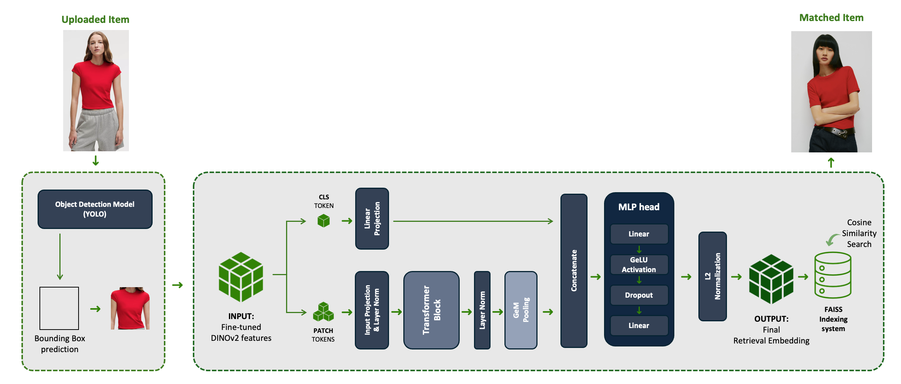
</p>
<p align="center"><em>Figure 1. Full Pipeline Architecture.</em></p>

The clothing detection component of the system contains a finetuned YOLO model that will produce a bounding box around the target clothes, then use the boxes to produce crops that can be used by the retrieval model.

The retrieval model takes the image and creates an embedding from pretrained DINOv2 features. A transformer block will then take in the features and project them. The projected embeddings will be compared to a FAISS index of projected gallery embeddings using cosine similarity. The top k results will be returned to the user.


### 3.2 Localization Component
The localization model was developed predominantly for ease of tool operability such that a user can simply upload an image and the tool can identify clothing without the need for prior cropping. As such, we focused on finetuning an existing model. Given the intended potential commercial use, it was important that our crops could be found with great speed and relative accuracy. For this reason we chose YOLO to form the backbone, then finetuned manually with different hyperparameters to achieve higher precision. 

The main code for the localization model can be found [here](https://github.com/annaszatan/FashionMatcher/blob/main/ml/models/localization_model.py).

### 3.3 Retrieval Component
The retrieval model is the heart of this tool, providing similar results for given image crop sourced from a gallery of images stored locally. For this reason, significant work was done to determine the best architecture to carry out this task.

For the retrieval model, we evaluated different feature extractors for image embedding generation, including ResNet18 as a CNN baseline (supervised learning) and DINOv2 as a Vision Transformer (self-supervised). The results show that DINOv2 significantly outperforms the ResNet baseline due to its ability to capture richer semantic and structural features.

To further improve performance, we applied LoRA (Low-Rank Adaptation), a parameter-efficient fine-tuning method that adapts the attention layers of DINOv2 to the target dataset. This approach achieves the best retrieval performance while maintaining low computational cost.

For a look into some of our experiments with ResNet and DINO, please see [this notebook](https://github.com/annaszatan/FashionMatcher/blob/main/ml/training/Resnet_Dino_Experiments.ipynb)


---

## 4.0 Results

### 4.1 Localization Component
This section provides an overview of the training and validation process for developing the localization component of the FashionMatcher tool.

#### 4.1.1 Quantitative
A trial of 26 different manually tuned configurations were attempted adjusting for number of epochs, batch size, optimizer, starting learning rate, learning rate decay type, ration learning rate final, and momentum. The hyperparameter tuning was assessed primarily via mAP50-95 (mean average precision metric), however mAP50, precision, and recall were also considered in tuning. 

Pytorch estimated optimal parameters for the model were used to get an initial baseline for performance. Each individual hyperparameter was accessed to find the approximate optimal value when only the given hyperparameter is modified. The individually optimized parameters were then combined to attempt to obtain a further optimized set of hyperparameters. This logic is process is not definitive, and often modifying one hyperparameter will adjust the optimal value for a different hyperparameter. Hence the hyperparameters were then further adjusted to attempt to further the hyperparameters. It should be noted that this process very likely did not find the optimal hyperparameters, but this is a quick method for finding a ‘reasonable’ set of hyperparameters with manual tuning. My method also made the assumption that the method which performed best at 5 epochs would also perform best at a greater number of epochs, however this may not be true. Attached below is a table summarizing the different inputs, and their respective outcomes. 

*Table 3. Localization Model Validation Data Hypertuning*

| Test                                           | Number of Epochs | Batch Size | Optimizer | LR Start | LR Decay Type | Ratio Learning Rate Final | Momentum | mAP50    | mAP50-95 |
|------------------------------------------------|------------------|------------|-----------|----------|----------------|----------------------------|----------|----------|-----------|
| Pytorch Default Parameters                     | 5                | 32         | AdamW     | 0.002    | Linear         | 0.01                       | 0.9      | 0.9407918 | 0.7275296 |
| CombiningAll Individually Tuned Parameters     | 5                | 16         | AdamW     | 0.0005   | Linear         | 0.01                       | 0.8      | 0.9424337 | 0.754898  |
| Most Optimized Hyperparameters Using 5 Epochs  | 5                | 20         | AdamW     | 0.0005   | Log            | 0.01                       | 0.85     | 0.9468570 | 0.7595161 |
| Most Optimized Hyperparameters Using 60 Epochs | 60               | 20         | AdamW     | 0.0005   | Log            | 0.01                       | 0.85     | 0.979054  | 0.8449360 |

It can be seen that the pytorch optimized parameters provided a well optimized initial estimate for hypermeters at mAP50-95 equal to 0.728 with 5 epochs of training. After 25 trials of manual tuning the most optimized set of hyperparameters generated, provided an mAP50-95 of 0.760 at 5 epochs. With increasing the training via the number of epochs gradually to 60 epochs the best outcome achieved was a mAP50-95 equal to 0.845. 

The training curve for the best performing set of hyperparameters achieved for the four metrics asses can be seen below followed by a confusion matrix demonstrating the efficacy of the model.  

<p align="center">
  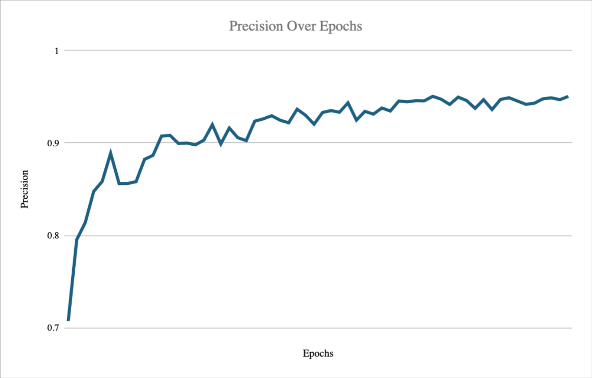
  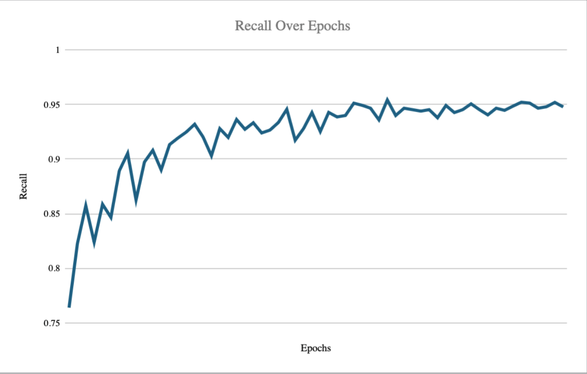
</p>
<p align="center">
  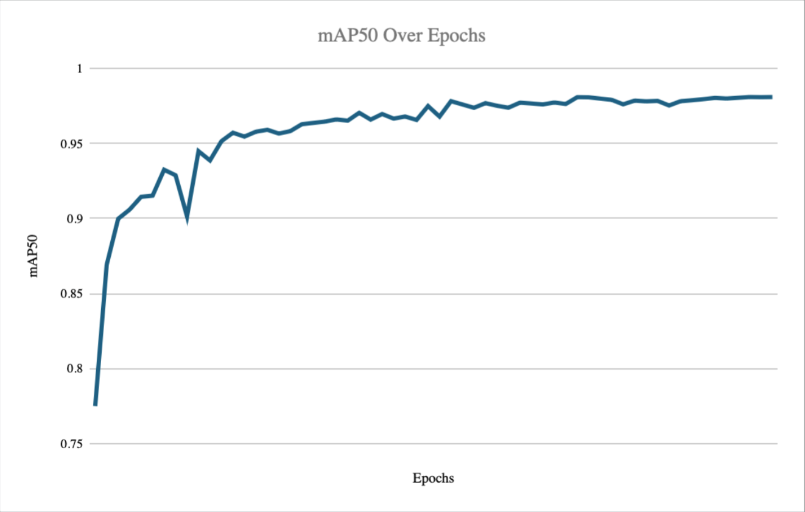
  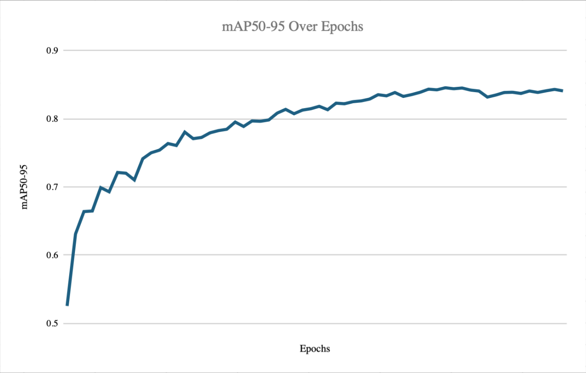
</p>
<p align="center"><em>Figure 2. Localizer Training Curves.</em></p>

The model was also tested for over-fitting of the hyperparameters, with the testing dataset having marginally (0.1%) better performance than the validation dataset by chance. This hence proved that overfitting due to hyperparameter tuning had not occurred. With only 27 hyperparameter tuning trials on this large dataset, this form of overfitting was unlikely. 

<p align="center">
	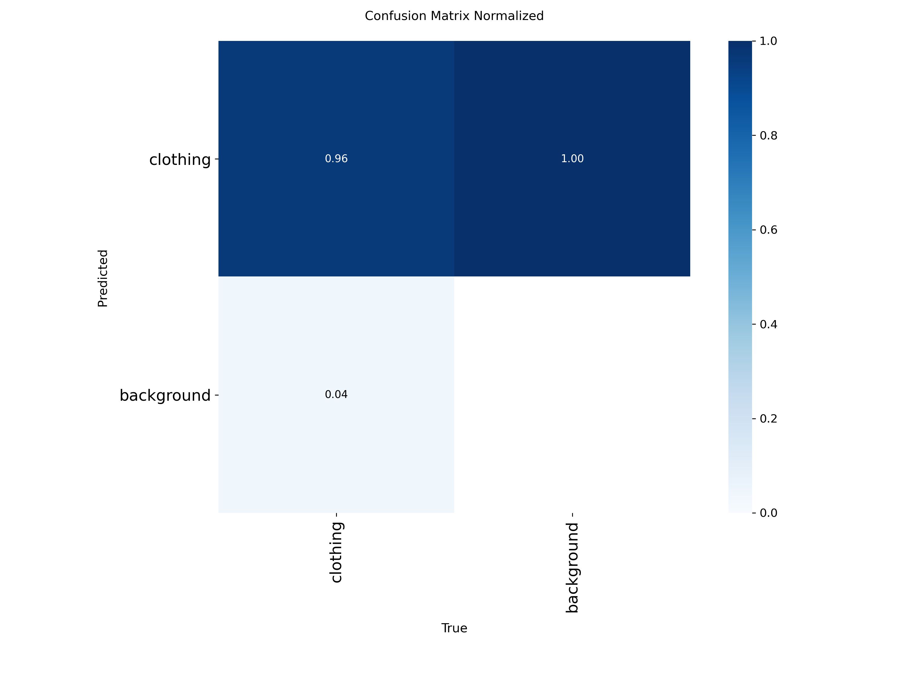
</p>
<p align="center"><em>Figure 3. Confusion Matrix for Best Performing Model.</em></p>


#### 4.1.2 Qualitative
The localization model’s effectiveness at generating appropriate bounding boxes can be seen in the four images attached. As seen from the confusion matrix the model has an acceptable successful localization rate. Some of the errors experienced from the model can be seen in the attached images. In image “000001” the model appears to fail to identify the shirt on the woman's body, while the bounding box on the pants is very well defined. Another point of criticism is that in image “000000” the bounds box for the pants appears to extend past the pants noticeable, possibly creating confusion further in the pipeline due to the distinct shirt. 

<p align="center">
	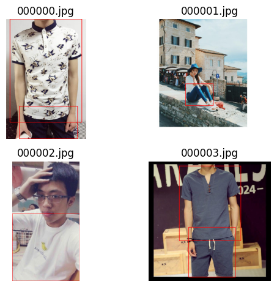
</p>
<p align="center"><em>Figure 4. Localizer Bounding Boxes.</em></p>

### 4.2 Retrieval Component
This section provides an overview of the results from training and testing the retrieval portion of the FashionMatcher tool.

#### 4.2.1 Quantitative
The best training performance reaches a Recall@10 of approximately 0.41, while performance on unseen validation data decreases to 0.34. This indicates that for about 34% of the queries, the correct item (same pair_id) is retrieved within the top 10 results.
 
The training results show a steady improvement over epochs, suggesting that the model successfully learns meaningful feature representations for the retrieval task. However, a gap between training and testing performance is observed.
 
This difference can be attributed to two main factors. First, the model is trained on a relatively limited subset of the data (approximately 5,000 samples), which may restrict its ability to generalize. Second, the test set contains more challenging examples, including variations in pose, lighting, background, and occlusion—common characteristics of the DeepFashion2 dataset—which make retrieval more difficult.
 
Despite this gap, the model maintains strong performance on unseen data, indicating that the learned embeddings generalize reasonably well. The moderate drop in Recall@10 (from 0.41 to 0.34) suggests that the model captures meaningful visual features while remaining robust across different domains.


#### 4.2.2 Qualitative
The figure shows that the model successfully retrieves visually similar clothing items, particularly capturing key attributes such as color (white), garment type (blouse), and structural details (ruffled sleeves and texture). The top-ranked results (Top 1–Top 3) are highly consistent with the query, indicating strong embedding quality.

However, some variations appear in lower-ranked results (Top 4–Top 5), where differences in style, lighting, or pose are more noticeable. This suggests that while the model captures global appearance effectively, it may struggle with fine-grained distinctions or variations in viewpoint.
Overall, the qualitative results align with the quantitative performance, demonstrating that the model is capable of retrieving semantically similar items, although ranking accuracy can still be improved for more challenging cases.

<p align="center">
	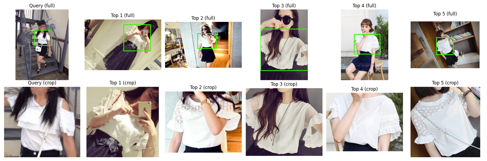
</p>
<p align="center"><em>Figure 4. Example Queries and Top Results from Retrieval Model.</em></p>

#### 4.2.3 Additional Experiments

The following table summarizes the results from experimenting with various retrieval models.

*Table 4. Retrieval Model Results*
| Model                      | R@1  | R@5  | R@10 |
|----------------------------|------|------|------|
| ResNet18                   | 0.07 | 0.13 | 0.17 |
| DINO Frozen                | 0.15 | 0.25 | 0.31 |
| DINO + LoRA                | 0.21 | 0.35 | 0.41 |
| Ours (Transformer-based)   | 0.07 | 0.24 | 0.34 |

ResNet18 finds the correct items on the first try 7% of the time. Even when given 10 chances it only succeeds 17% of the time.  ResNet18 achieves the lower performance than DINO due to its limited ability to capture fine-grained visual similarities. 

DINO significantly improves retrieval by learning richer semantic features through self-supervised training. Further improvements are obtained using LoRA (needed to handle tricky, similar looking items), which adapts the model to the dataset while keeping training efficient. 

The consistent increase in Recall@K indicates that the model often retrieves correct items within the top results, though ranking remains imperfect due to the difficulty of our model to distinghish between very similar clothing items.

We achieve the best performance by evaluating multiple training scenarios and configurations. The most relevant experiments are summarized in Figures 4–6, which present the Recall@10 results for Triplet Loss, InfoNCE Loss, and Supervised Contrastive Loss (SupCon), respectively.

<p align="center">
	
</p>
<p align="center"><em>Figure 5. (1) Supcon Loss, (2) InfoNCE Loss, (3) Triplet Loss.</em></p>

From these graphs, we observe a consistent improvement in performance as the model transitions from a frozen baseline to more advanced fine-tuning strategies. In all three loss functions, the frozen baseline shows the lowest performance (Recall@10 ≈ 0.052), indicating that pretrained features alone are not sufficient for this task. Linear probing provides only a marginal improvement, suggesting that shallow adaptation is limited in capturing fine-grained similarities.
 
A significant performance gain is achieved with partial fine-tuning, where the model begins to adapt to the dataset. However, the most notable improvement comes from applying LoRA-based fine-tuning. Across all loss functions, the LoRA configuration consistently achieves the highest Recall@10, reaching approximately 0.278 for Triplet Loss, 0.400 for InfoNCE, and 0.407 for SupCon.
 
Among the evaluated loss functions, SupCon Loss achieves the best overall performance. This can be attributed to its ability to leverage multiple positive samples within a batch, leading to more discriminative and well-structured embeddings. InfoNCE also performs strongly, benefiting from its contrastive formulation, while Triplet Loss shows comparatively lower performance due to its sensitivity to sampling strategies.
 
Interestingly, full fine-tuning results in a significant drop in performance across all loss functions. This suggests potential overfitting or instability when updating all model parameters, highlighting the effectiveness of parameter-efficient methods such as LoRA.

Overall, these results demonstrate that both the choice of loss function and the fine-tuning strategy play a critical role in retrieval performance, with SupCon combined with LoRA providing the best results in this study.


### 4.3 Full Pipeline

#### 4.3.1 Quantitative

<p align="center">
	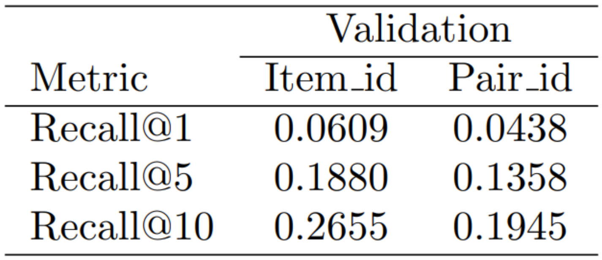
</p>
<p align="center"><em>Figure 6. Full Pipeline Results.</em></p>

To evaluate the retrieval performance, the original training dataset was split into two subsets: Gallery images (shop-side clothing images) and Query images (consumer-side images where clothing is worn). The model was trained exclusively on the Gallery set and evaluated using the Query set to simulate a realistic retrieval scenario.

The dataset consists of 57,979 Gallery images (72%) and 22,566 Query images (28%), ensuring a sufficiently large search space while maintaining a diverse set of query samples.

As shown in the validation results, performance was evaluated using Recall@K under two matching criteria: Item_id (exact same clothing instance) and Pair_id (paired but not necessarily identical items).

Under the Item_id setting, the model achieves:
* Recall@1: 0.0609
* Recall@5: 0.1880
* Recall@10: 0.2655

Under the Pair_id setting, the performance is slightly lower:
* Recall@1: 0.0438
* Recall@5: 0.1358
* Recall@10: 0.1945

These results indicate that the model performs better when retrieving the exact same item (Item_id) compared to retrieving paired items (Pair_id).

Additionally, the steady increase in Recall as K increases suggests that relevant items are often ranked within the top candidates, even if not always at the top position. This indicates that while the model captures meaningful visual similarity, there is still room for improvement in fine-grained ranking at higher precision levels (e.g., Recall@1).


#### 4.3.2 Qualitative
**Success Case**

<p align="center">
	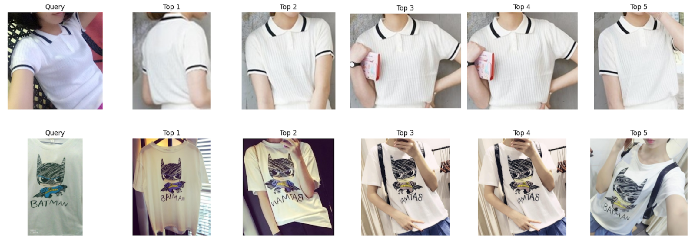
</p>
<p align="center"><em>Figure 7. Good Example from Pipeline.</em></p>

Figure 6 presents qualitative results of the full pipeline, showing the Top-K retrieved items for success cases.

In the success cases, the model demonstrates a strong ability to capture distinctive visual features. For example, it successfully identifies subtle details such as the black stripe on the collar of a polo shirt, which plays an important role in distinguishing similar items. In addition, the model performs well in recognizing graphic elements and characters, retrieving visually consistent items when the query contains clear and identifiable prints (e.g., character-based designs). These results indicate that the model effectively learns discriminative features that are robust to variations in pose and background.

**Failure Case**
<p align="center">
	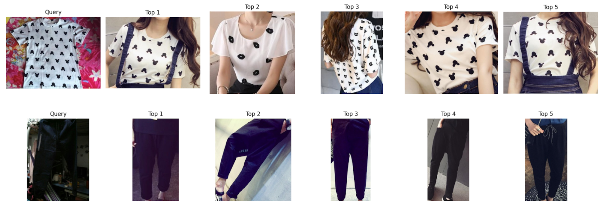
</p>
<p align="center"><em>Figure 8. Failure Example from Pipeline.</em></p>

Figure 7 presents qualitative results of the full pipeline, showing the Top-K retrieved items for failure cases. The failure cases reveal two main limitations:

**Complex patterns:**
While the model is capable of capturing repetitive patterns, it struggles to differentiate between visually similar but semantically different patterns. For instance, patterns such as Mickey Mouse, cats, or lip prints may share similar shapes or layouts, leading the model to retrieve incorrect items. This suggests that the model relies more on low-level visual similarity rather than fine-grained semantic understanding.

**Ambiguous query images:**
In some cases, the query image itself is difficult to interpret due to factors such as poor lighting, occlusion, or lack of clear visual cues. When the query does not provide sufficient information, the retrieval results become less reliable. This highlights the model’s sensitivity to input quality and clarity.

Overall, the qualitative results show that the model performs well when clear and distinctive features are present, but struggles with fine-grained pattern discrimination and ambiguous visual inputs.


---

## 5.0 New Data
To demonstrate the viability of this product for an everyday user, we developed a simple user interface that would allow for individuals to upload an image and receive a similar item returned based on a small selection of items scraped from American Eagle. In the example below, we can see that a similar "off-the-shoulder" style is returned in a slightly different colour.

<p align="center">
	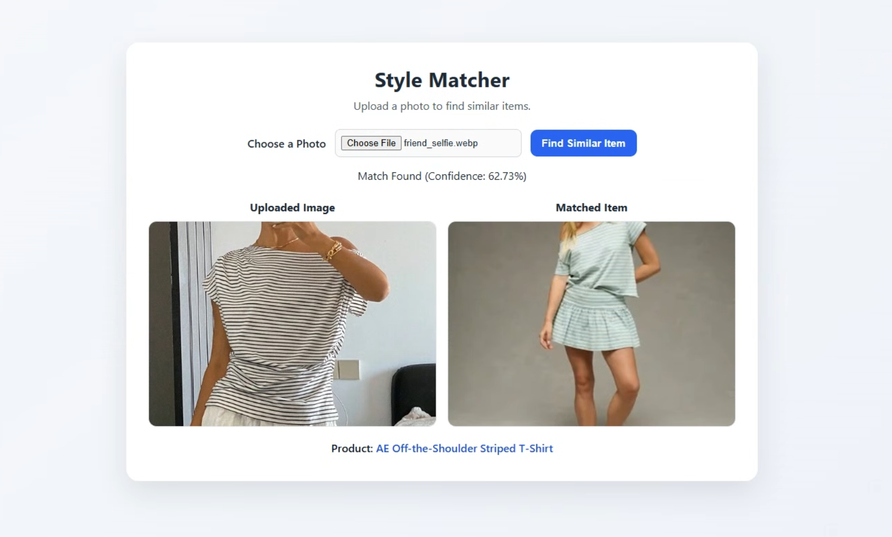
</p>
<p align="center"><em>Figure 9. Example new data image with good performance.</em></p>

This next example is an exact match for the item from American eagle, with a very high similarity score.

<p align="center">
	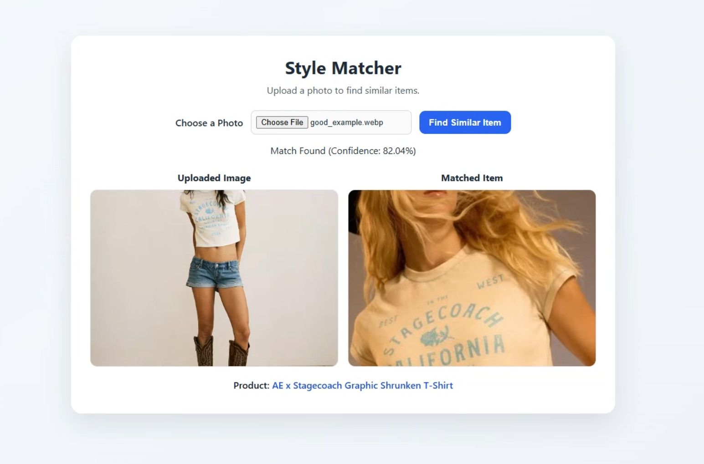
</p>
<p align="center"><em>Figure 10. Example new data image with perfect performance.</em></p>

Although the model works well in these cases, there are some cases were the model cannot appropriately determine a match. While the fit of the shirt may be appropriate, the colour is off.

<p align="center">
	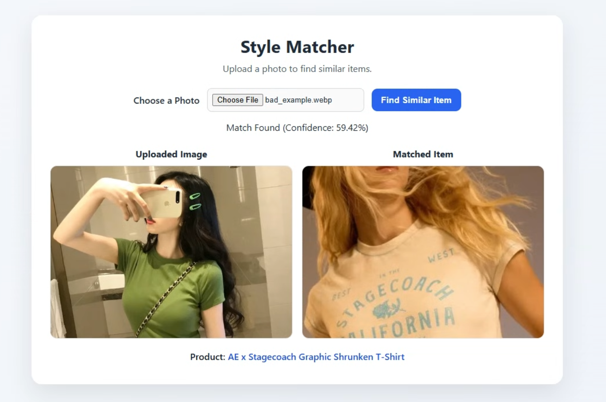
</p>
<p align="center"><em>Figure 11. Example new data image with poor performance.</em></p>

---

## 6.0 Related Work

Over the years this problem has been attempted numerous times, with varying levels of success. Early work did not involve deep learning, and instead used standard computer vision with colour matching and algorithms such as SIFT. With progress in deep learning, better models for image similarity became possible. An early paper was from the CVP (computer vision foundation) in 2014 titled “Learning Fine-grained Image Similarity with Deep Ranking” [1]. This paper demonstrated a deep learning image similarity architecture was able to outperform the period computer vision approaches using hand-crafted visual features. 

In 2014 IEEE published a paper titled “On visual similarity based interactive product recommendation for online shopping” [2], which demonstrated similar product recommendations based on image similarity. This demonstrated the application for general product similarity search, however not specifically for fashion. In 2015 the computer vision foundation published another paper titled “Where to Buy It: Matching Street Clothing Photos in Online Shops” [3]. This paper implemented image similarity search directly to the context of fashion, and used ‘street to shop’ comparison. This is particularly challenging since the images found from online retailers have substantially different lighting and poses from street images, which is discussed in the paper. 

Following these papers consumer applications of this technology began to be more prevalent. In 2017 there was the release of Bixby Vision (Samsung), Google Lens, and Pinterest Lens. These were all models tailored towards general shopping or item recommendations in particular, rather than specifically clothing however. 


---

## 7.0 Discussion

In this project, we developed an end-to-end fashion image retrieval system and evaluated it. The model achieved moderate performance, with a Recall@10 of 0.2665 for Item ID matching and lower results for Pair ID matching. While the system can retrieve visually similar items, it often fails to identify the exact same product, indicating limitations in fine-grained instance-level retrieval.

Qualitative results show mixed performance. The model sometimes retrieves the correct item but often confuses similar products, capturing general attributes like color or clothing type while missing instance-level differences. Failures mainly arise from two issues: difficulty handling complex patterns and ambiguity in query images (e.g., occlusion or poor lighting), which make accurate retrieval challenging. In the quantitative results, the best performance among our custom approaches was achieved using fine-tuned DINOv2 embeddings with a transformer-based retrieval model, reaching a Recall@10 of 0.342. Although this is lower than directly fine-tuning DINOv2 with LoRA (Recall@10 = 0.407), it shows that our model can achieve competitive performance relative to a strong pretrained baseline.

One of the most important lessons learned from this project is the significant impact of pretrained models. Initially, we experimented with custom models designed from scratch; however, these models performed extremely poorly, achieving near-zero recall. In contrast, leveraging pretrained models such as DINOv2 led to substantial improvements in performance, especially when fine-tuned for the target domain. Interestingly, we also observed that increasing model complexity does not necessarily lead to better results. For example, combining frozen DINO embeddings with additional architectures such as CNNs or Transformers through transfer learning often resulted in degraded performance. This suggests that improperly aligned feature spaces or unnecessary architectural complexity can harm retrieval quality.

Another key challenge was computational cost and experiment planning. Although we expected experiments to take time, it was more difficult than anticipated to decide which ones were worth running. Since training on a large-scale dataset like DeepFashion2 is time-consuming, testing every idea was impractical, highlighting the need for strategic and selective experiment design based on clear hypotheses. We also faced challenges integrating multiple components into a unified pipeline. Combining YOLO and DINOv2 required careful coordination, and differences in implementation caused integration issues. Extending the system for real-world use further required additional data processing and feature extraction scripts, emphasizing the importance of consistent code structure and clear collaboration in large projects.

If we were to approach this project again, there are several things we would have liked to know in advance. First, since simply fine-tuning pretrained models was not encouraged, we would have benefited from a better understanding of how to effectively leverage pretrained features while designing our own models on top of them. This would have helped us more quickly identify effective model designs without relying on inefficient trial-and-error. Second, better planning and prioritization of experiments would have helped us make more efficient use of limited computational resources, especially given the high cost of training on large-scale datasets. Third, we learned that integrating code across different components and team members can be more challenging than expected. Inconsistent implementations and lack of standardized structure made the integration process time-consuming, highlighting the importance of clear coding conventions and coordination from the early stages. Finally, placing greater emphasis on data quality and augmentation strategies early in the project could have improved the model’s robustness to real-world variations.


---

## 8.0 References

[1] J. Wang et al., “Learning Fine-grained Image Similarity with Deep Ranking,” arXiv:1404.4661 [cs], Apr. 2014, Available: https://arxiv.org/abs/1404.4661

[2] J.-H. Hsiao and L.-J. Li, “On visual similarity based interactive product recommendation for online shopping,” IEEE Xplore, Oct. 01, 2014. https://ieeexplore.ieee.org/abstract/document/7025614 (accessed Apr. 05, 2026).

[3] M. H. Kiapour, X. Han, S. Lazebnik, A. C. Berg, and T. L. Berg, “Where to Buy It: Matching Street Clothing Photos in Online Shops,” 2015 IEEE International Conference on Computer Vision (ICCV), Dec. 2015, doi: https://doi.org/10.1109/iccv.2015.382.

---

## 9.0 Repository Guide

#### Set Up
1. Create a new conda environment and install all packages in requirements.txt
```
conda create -n mie1517_project python=3.11
conda activate mie1517_project
pip install -r requirements.txt
```
2. Download this checkpoints folder and place it in the "ml" folder.

#### Testing
1. Run the following scripts from the terminal to generate the feature data and indices for the validation dataset
```bash
python ml/training/extract_lora_retrieval_tokens.py
python ml/preprocessing/build_projected_faiss_index.py
```
2. Run the following script from the terminal to evaluate the pipeline
```
python scripts/evaluate_pipeline.py --metadata_csv ml/data/version2/validation_metadata.csv
```
All results will be stored in the ml/results folder

#### Demo App
1. Run the following in the terminal
```
python run.py
```
2. Go to the link http://127.0.0.1:5000
